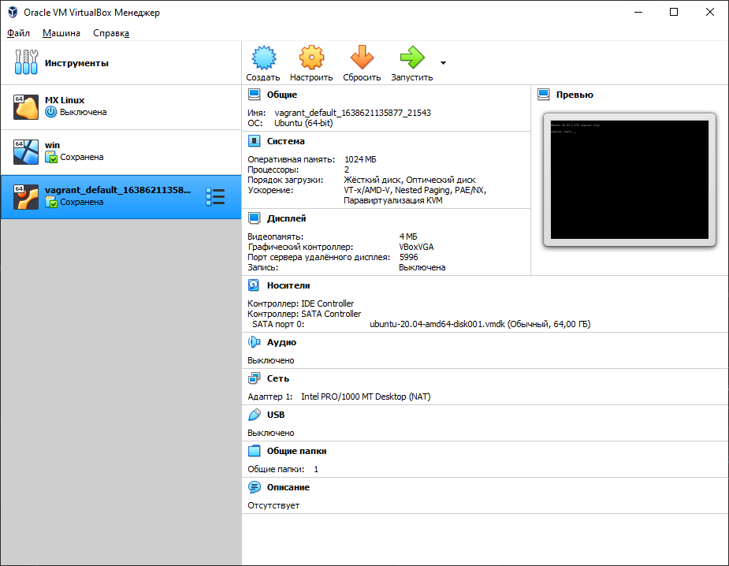

## Результат выполнения домашней работы

1. Скачал и установил [VirtualBox 6.1.30](https://download.virtualbox.org/virtualbox/6.1.30/VirtualBox-6.1.30-148432-Win.exe)
2. Скачал и установил [Vagrant 2.2.19](https://releases.hashicorp.com/vagrant/2.2.19/vagrant_2.2.19_x86_64.msi)
3. Установил Windows Terminal (cmd)
```bash
    $winget install --id=Microsoft.WindowsTerminal -e
```
3.1 Установил Chocolatey (Power Shell от имени админа)

```bash
    PS C:\Users\reyso> Set-ExecutionPolicy Bypass -Scope Process -Force; iex ((New-Object System.Net.WebClient).DownloadString('https://chocolatey.org/install.ps1'))
    Forcing web requests to allow TLS v1.2 (Required for requests to Chocolatey.org)
    Getting latest version of the Chocolatey package for download.
    Not using proxy.
    Getting Chocolatey from https://community.chocolatey.org/api/v2/package/chocolatey/0.11.3.
    Downloading https://community.chocolatey.org/api/v2/package/chocolatey/0.11.3 to C:\Users\reyso\AppData\Local\Temp\chocolatey\chocoInstall\chocolatey.zip
    Not using proxy.
    Extracting C:\Users\reyso\AppData\Local\Temp\chocolatey\chocoInstall\chocolatey.zip to C:\Users\reyso\AppData\Local\Temp\chocolatey\chocoInstall
    Installing Chocolatey on the local machine
    Creating ChocolateyInstall as an environment variable (targeting 'Machine')
      Setting ChocolateyInstall to 'C:\ProgramData\chocolatey'
    WARNING: It's very likely you will need to close and reopen your shell
      before you can use choco.
    WARNING: Not able to set permissions for C:\ProgramData\chocolatey.
    We are setting up the Chocolatey package repository.
    The packages themselves go to 'C:\ProgramData\chocolatey\lib'
      (i.e. C:\ProgramData\chocolatey\lib\yourPackageName).
    A shim file for the command line goes to 'C:\ProgramData\chocolatey\bin'
      and points to an executable in 'C:\ProgramData\chocolatey\lib\yourPackageName'.
    
    Creating Chocolatey folders if they do not already exist.
    
    WARNING: You can safely ignore errors related to missing log files when
      upgrading from a version of Chocolatey less than 0.9.9.
      'Batch file could not be found' is also safe to ignore.
      'The system cannot find the file specified' - also safe.
    chocolatey.nupkg file not installed in lib.
     Attempting to locate it from bootstrapper.
    PATH environment variable does not have C:\ProgramData\chocolatey\bin in it. Adding...
    WARNING: Not setting tab completion: Profile file does not exist at 'C:\Users\reyso\Documents\PowerShell\Microsoft.PowerShell_profile.ps1'.
    Chocolatey (choco.exe) is now ready.
    You can call choco from anywhere, command line or powershell by typing choco.
    Run choco /? for a list of functions.
    You may need to shut down and restart powershell and/or consoles
     first prior to using choco.
    Ensuring Chocolatey commands are on the path
    Ensuring chocolatey.nupkg is in the lib folder
```
3.2 Установил редактор nano - [Руководство по nano](https://blog.sedicomm.com/2018/11/21/rukovodstvo-po-ispolzovaniyu-tekstovogo-redaktora-nano-v-linux-dlya-nachinayushhih/)
```bash
    PS C:\Users\reyso> choco install nano
    Chocolatey v0.11.3
    Installing the following packages:
    nano
    By installing, you accept licenses for the packages.
    Progress: Downloading nano 2.5.3... 100%
    
    nano v2.5.3 [Approved] - Likely broken for FOSS users (due to download location changes)
    nano package files install completed. Performing other installation steps.
    The package nano wants to run 'chocolateyInstall.ps1'.
    Note: If you don't run this script, the installation will fail.
    Note: To confirm automatically next time, use '-y' or consider:
    choco feature enable -n allowGlobalConfirmation
    Do you want to run the script?([Y]es/[A]ll - yes to all/[N]o/[P]rint): y
    
    WARNING: Url has SSL/TLS available, switching to HTTPS for download
    Downloading nano
      from 'https://www.nano-editor.org/dist/v2.5/NT/nano-2.5.3.zip'
    Progress: 100% - Completed download of C:\Users\reyso\AppData\Local\Temp\chocolatey\nano\2.5.3\nano-2.5.3.zip (2.04 MB).
    Download of nano-2.5.3.zip (2.04 MB) completed.
    Hashes match.
    Extracting C:\Users\reyso\AppData\Local\Temp\chocolatey\nano\2.5.3\nano-2.5.3.zip to C:\ProgramData\chocolatey\lib\nano\tools...
    C:\ProgramData\chocolatey\lib\nano\tools
     ShimGen has successfully created a shim for nano.exe
     The install of nano was successful.
      Software installed to 'C:\ProgramData\chocolatey\lib\nano\tools'
    
    Chocolatey installed 1/1 packages.
     See the log for details (C:\ProgramData\chocolatey\logs\chocolatey.log).
```
4. Создал папку `vagrant`
```bash
$ cd c:\
$ mkdir vagrant
```
4.1 Выполнена команда `vagrant init` в директории `vagrant`
```bash
$ cd vagrant
$ vagrant init
```
4.2 Далее, изменил содержимое `Vagrantfile`
```bash
$ nano Vagrantfile
```
Новое содержание:
```bash
    Vagrant.configure("2") do |config|
    config.vm.box = "bento/ubuntu-20.04"
    end
```
4.3 Произвел `vagrant up` после окончание процесса `vagrant suspend`

   * Выполнение в этой директории `vagrant up` установит провайдер VirtualBox для Vagrant, скачает необходимый образ и запустит виртуальную машину.
   * `vagrant suspend` выключит виртуальную машину с сохранением ее состояния (т.е., при следующем `vagrant up` будут запущены все процессы внутри, которые работали на момент вызова suspend), `vagrant halt` выключит виртуальную машину штатным образом.
   
```bash
    Bringing machine 'default' up with 'virtualbox' provider...
    ==> default: Importing base box 'bento/ubuntu-20.04'...
    ==> default: Matching MAC address for NAT networking...
    ==> default: Checking if box 'bento/ubuntu-20.04' version '202107.28.0' is up to date...
    ==> default: Setting the name of the VM: vagrant_default_1638621135877_21543
    ==> default: Clearing any previously set network interfaces...
    ==> default: Preparing network interfaces based on configuration...
    default: Adapter 1: nat
    ==> default: Forwarding ports...
    default: 22 (guest) => 2222 (host) (adapter 1)
    ==> default: Booting VM...
    ==> default: Waiting for machine to boot. This may take a few minutes...
    default: SSH address: 127.0.0.1:2222
    default: SSH username: vagrant
    default: SSH auth method: private key
    default:
    default: Vagrant insecure key detected. Vagrant will automatically replace
    default: this with a newly generated keypair for better security.
    default:
    default: Inserting generated public key within guest...
    default: Removing insecure key from the guest if it's present...
    default: Key inserted! Disconnecting and reconnecting using new SSH key...
    ==> default: Machine booted and ready!
    ==> default: Checking for guest additions in VM...
    ==> default: Mounting shared folders...
    default: /vagrant => C:/vagrant
```
4.4 Потушил машину:
```bash
    ==> default: Saving VM state and suspending execution...
```

5. Согласно графическому интерфейсу VirtualBox, выделены следующие ресурсы:


**Система**
* Оперативная память: 1024 MB 
* Процессоры: 2

**Дисплей**
* Видео память: 4 MB
* Графический контроллер: VBoxVGA

6. Возможности конфигурации VirtualBox через Vagrantfile: [документация](https://www.vagrantup.com/docs/providers/virtualbox/configuration.html).

**Как добавить оперативной памяти или ресурсов процессора виртуальной машине?**

Для изменения конфигурации необходимо добавить блок `config.vm.provider`:

* В терминале выполним `nano Vagrantfile`
* Добавим новый блок (`v.memory = 1024` размер памяти `v.cpus = 2` количество ЦПУ):
```bash
config.vm.provider "virtualbox" do |v|
    v.memory = 2048
    v.cpus = 4
end
```
* Выключить VM выполнив команду `vagrant halt` и перезапустить Vagrant `vagrant up`.

_Результат - системные ресурсы изменились._


7. Команда `vagrant ssh` из директории, в которой содержится Vagrantfile, позволит оказаться внутри виртуальной машины без каких-либо дополнительных настроек.
```bash
PS C:\vagrant> vagrant ssh
Welcome to Ubuntu 20.04.2 LTS (GNU/Linux 5.4.0-80-generic x86_64)

 * Documentation:  https://help.ubuntu.com
 * Management:     https://landscape.canonical.com
 * Support:        https://ubuntu.com/advantage

  System information as of Sat 04 Dec 2021 01:52:10 PM UTC

  System load:  0.2               Processes:             139
  Usage of /:   2.5% of 61.31GB   Users logged in:       0
  Memory usage: 7%                IPv4 address for eth0: 10.0.2.15
  Swap usage:   0%


This system is built by the Bento project by Chef Software
More information can be found at https://github.com/chef/bento
Welcome to Ubuntu 20.04.2 LTS (GNU/Linux 5.4.0-80-generic x86_64)

 * Documentation:  https://help.ubuntu.com
 * Management:     https://landscape.canonical.com
 * Support:        https://ubuntu.com/advantage

  System information as of Sat 04 Dec 2021 01:52:10 PM UTC

  System load:  0.2               Processes:             139
  Usage of /:   2.5% of 61.31GB   Users logged in:       0
  Memory usage: 7%                IPv4 address for eth0: 10.0.2.15
  Swap usage:   0%


This system is built by the Bento project by Chef Software
More information can be found at https://github.com/chef/bento
```
8. Ознакомиться с разделами `man bash`, почитать о настройках самого bash:

* какой переменной можно задать длину журнала `history`, и на какой строчке manual это описывается?

  * Посмотрим на каких строках упоминается команда `history` командой `man bash | grep -n history`
  * После этого командой `man bash | sed -n 'X,+Yp'` посмотрим упоминания команды и найдём переменную задающую длину журнала. Командой `cat -n` выведем номера строк

```bash
man bash | grep -n history
```

```bash
...
622:              The maximum number of lines contained in the history file.  When this variable is assigned a value, the history file is truncated, if necessary, to contain no more than that number of lines
...
```

```bash
man bash | cat -n | sed -n '622,+20p'

```

```bash
...
   621         HISTFILESIZE
   622                The maximum number of lines contained in the history file.  When this variable is assigned a value, the history file is truncated, if necessary, to contain no more than that number of lines
   623                by removing the oldest entries.  The history file is also truncated to this size after writing it when a shell exits.  If the value is 0, the history file is truncated to zero  size.   Non-
   624                numeric values and numeric values less than zero inhibit truncation.  The shell sets the default value to the value of HISTSIZE after reading any startup files.
...
```

Переменная `HISTFILESIZE` задаёт длину журнала `history`, описывается на 621-624 строках.

* что делает директива `ignoreboth` в bash?

```bash
man bash | grep -B 2 -A 3 ignoreboth
```

```bash
       HISTCONTROL
              A  colon-separated list of values controlling how commands are saved on the history list.  If the list of values includes ignorespace, lines which begin with a space character are not saved
              in the history list.  A value of ignoredups causes lines matching the previous history entry to not be saved.  A value of ignoreboth is shorthand for ignorespace and ignoredups.  A value of
              erasedups  causes all previous lines matching the current line to be removed from the history list before that line is saved.  Any value not in the above list is ignored.  If HISTCONTROL is
              unset, or does not include a valid value, all lines read by the shell parser are saved on the history list, subject to the value of HISTIGNORE.  The second and subsequent lines of a  multi-
              line compound command are not tested, and are added to the history regardless of the value of HISTCONTROL.
```

Значение `ignoredups` приводит к тому, что строки, соответствующие предыдущей записи в истории, не сохраняются. Значение `ignoreboth` является сокращением для `ignorespace` и `ignoredups.`

9. В каких сценариях использования применимы скобки `{}` и на какой строчке `man bash` это описано?

```bash
man bash | grep -n {
....
man bash | cat -n | sed -n '200,+40p'
}
```
```bash
   206         { list; }
   207                list  is  simply executed in the current shell environment.  list must be terminated with a newline or semicolon.  This is known as a group command.  The return status is the exit status of
   208                list.  Note that unlike the metacharacters ( and ), { and } are reserved words and must occur where a reserved word is permitted to be recognized.  Since they do not  cause  a  word  break,
   209                they must be separated from list by whitespace or another shell metacharacter.
   210
```
Фигурные скобки `{}` используются для вызова списка в командах. Описание на 206 строке.

10. Учитывая ответ на предыдущий вопрос, как создать однократным вызовом `touch` 100000 файлов? Получится ли аналогичным образом создать 300000? Если нет, то почему?

```bash
touch {1..100000}
```

100000 файлов создалось. 300000 нет, получил ошибку: `Argument list too long`. Существует ограничение на максимальное количество аргументов в команде. 

```bash
vagrant@vagrant:~$ getconf ARG_MAX
2097152
```
11. В man bash поищите по `/\[\[`. Что делает конструкция `[[ -d /tmp ]]`?

```bash
man bash | grep "\[\["
```

Конструкция `[[ -d /tmp ]]` возвращает 1, если выражение в скобках верное, 0 — если не верное.

```bash
[[ -d /tmp ]] && echo True
```

```bash
True
```

12. Основываясь на знаниях о просмотре текущих (например, PATH) и установке новых переменных; командах, которые мы рассматривали, добейтесь в выводе `type -a bash` в виртуальной машине наличия первым пунктом в списке:

	```bash
	bash is /tmp/new_path_directory/bash
	bash is /usr/local/bin/bash
	bash is /bin/bash
	```
	(прочие строки могут отличаться содержимым и порядком)
    В качестве ответа приведите команды, которые позволили вам добиться указанного вывода или соответствующие скриншоты.

```bash
mkdir /tmp/new_path_directory
cp /bin/bash /tmp/new_path_directory/bash
export PATH="/tmp/new_path_directory:$PATH"  
```

```bash
vagrant@vagrant:~$ type -a bash
bash is /tmp/new_path_directory/bash
bash is /usr/bin/bash
bash is /bin/bash
```

13. Чем отличается планирование команд с помощью `batch` и `at`?

    * `at` запускает команду в назначенное время.
    * `batch` запускает команду при достижении определённого уровня нагрузки системы.

14. VM выключена выполнив команду `sudo shutdown -h now`


