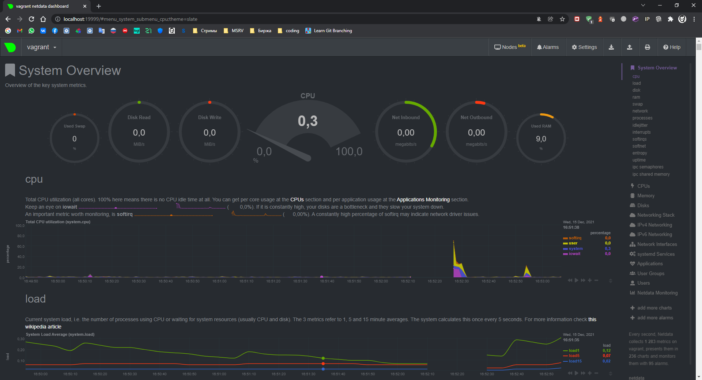

# Ответы

1. На лекции мы познакомились с [node_exporter](https://github.com/prometheus/node_exporter/releases). В демонстрации его исполняемый файл запускался в background. Этого достаточно для демо, но не для настоящей production-системы, где процессы должны находиться под внешним управлением. Используя знания из лекции по systemd, создайте самостоятельно простой [unit-файл](https://www.freedesktop.org/software/systemd/man/systemd.service.html) для node_exporter:

    * поместите его в автозагрузку,
    * предусмотрите возможность добавления опций к запускаемому процессу через внешний файл (посмотрите, например, на `systemctl cat cron`),
    * удостоверьтесь, что с помощью systemctl процесс корректно стартует, завершается, а после перезагрузки автоматически поднимается.

На [github](https://github.com/prometheus/node_exporter/releases) копируем путь для скачивания актуальной версии `node_exporter` и распаковываем его: 

```bash
vagrant@vagrant:~$ wget https://github.com/prometheus/node_exporter/releases/download/v1.3.1/node_exporter-1.3.1.linux-amd64.tar.gz

vagrant@vagrant:~$ tar xvfz node_exporter-1.3.1.linux-amd64.tar.gz
```

Чтобы поднять демона `node_exporter` создадим систем юзера `node_exporter`:

```bash
vagrant@vagrant:~$ sudo useradd -r -M -s /bin/false node_exporter
 ```
Создадим новый unit-файл и настроим его для `node_exporter`:

```bash
sudo nano /etc/systemd/system/node_exporter.service

[Unit]
Description=Prometheus Node Exporter
Wants=network-online.target
After=network-online.target

[Service]
User=node_exporter
Group=node_exporter
Type=simple
ExecStart=/home/vagrant/node_exporter-1.3.1.linux-amd64/node_expoter $EXTRA_OPTS

[Install]
WantedBy=multi-user.target
```

Запускаем демон:

```bash
vagrant@vagrant:~$ sudo systemctl daemon-reload
vagrant@vagrant:~$ sudo systemctl enable --now node_exporter.service
```


Открываем порты для node_exporter, по умолчанию 9100:

```bash
vagrant@vagrant:~$ sudo iptables -A INPUT -p tcp --dport 9100 -j ACCEPT
```
Проверяем статус сервиса `node_exporter`: 

```bash
vagrant@vagrant:~$ sudo systemctl status node_exporter.service
● node_exporter.service - Prometheus Node Exporter
     Loaded: loaded (/etc/systemd/system/node_exporter.service; enabled; vendor preset: enabled)
     Active: failed (Result: exit-code) since Wed 2021-12-15 09:02:02 UTC; 7s ago
    Process: 1782 ExecStart=/home/vagrant/node_exporter-1.3.1.linux-amd64/node_exporter $EXTRA_OPTS (code=exited, statu>
   Main PID: 1782 (code=exited, status=203/EXEC)
```

Поймал ошибку старта сервиса, скорее всего не верно прописал путь в Unit file, правим:

```bash
sudo nano /etc/systemd/system/node_exporter.service
```
Да пропустил букву `r` в `exporter`
```bash
ExecStart=/home/vagrant/node_exporter-1.3.1.linux-amd64/node_expoter $EXTRA_OPTS
```
Поправил, пробуем еще раз:

```bash
vagrant@vagrant:~$ sudo systemctl status node_exporter.service
● node_exporter.service - Prometheus Node Exporter
     Loaded: loaded (/etc/systemd/system/node_exporter.service; enabled; vendor preset: enabled)
     Active: active (running) since Wed 2021-12-15 09:07:24 UTC; 11min ago
   Main PID: 1882 (node_exporter)
      Tasks: 6 (limit: 2278)
     Memory: 2.6M
     CGroup: /system.slice/node_exporter.service
             └─1882 /home/vagrant/node_exporter-1.3.1.linux-amd64/node_exporter
...
```
Стартануло!

Для проверки автостарта грузанем машину `sudo reboot`. 
```bash
vagrant@vagrant:~$ sudo reboot
Connection to 127.0.0.1 closed by remote host.
Connection to 127.0.0.1 closed.
```
После перезагрузки проверим демон `node_exporter` был в .

```bash
● node_exporter.service - Prometheus Node Exporter
     Loaded: loaded (/etc/systemd/system/node_exporter.service; enabled; vendor preset: enabled)
     Active: active (running) since Wed 2021-12-15 09:21:18 UTC; 35s ago
```
Видим статус`active`

---

2. Ознакомьтесь с опциями node_exporter и выводом `/metrics` по-умолчанию. Приведите несколько опций, которые вы бы выбрали для базового мониторинга хоста по CPU, памяти, диску и сети.

Делаем запрос смотрим что ваще есть `curl http://localhost:9100/metrics`

Ага, выбираем из этой простыни, что нужно

CPU (`curl http://localhost:9100/metrics | grep node_cpu`):

  * node_cpu_seconds_total{cpu="0",mode="idle"} 2238.49
  * node_cpu_seconds_total{cpu="0",mode="system"} 16.72
  * node_cpu_seconds_total{cpu="0",mode="user"} 6.86
  * process_cpu_seconds_total

Disk (`curl http://localhost:9100/metrics | grep node_disk`):
   
   * node_disk_io_time_seconds_total{device="sda"} 
   * node_disk_read_bytes_total{device="sda"}
   * node_disk_read_time_seconds_total{device="sda"} 
   * node_disk_write_time_seconds_total{device="sda"}

Memory (`curl http://localhost:9100/metrics | grep node_memory`):

  * node_memory_MemAvailable_bytes 
  * node_memory_MemFree_bytes


Network (`curl http://localhost:9100/metrics | grep node_network`):

  * node_network_receive_errs_total{device="eth0"} 
  * node_network_receive_bytes_total{device="eth0"} 
  * node_network_transmit_bytes_total{device="eth0"}
  * node_network_transmit_errs_total{device="eth0"}

---

3. Установите в свою виртуальную машину [Netdata](https://github.com/netdata/netdata). Воспользуйтесь [готовыми пакетами](https://packagecloud.io/netdata/netdata/install) для установки (`sudo apt install -y netdata`). После успешной установки:
    * в конфигурационном файле `/etc/netdata/netdata.conf` в секции [web] замените значение с localhost на `bind to = 0.0.0.0`,
    * добавьте в Vagrantfile проброс порта Netdata на свой локальный компьютер и сделайте `vagrant reload`:

    ```bash
    config.vm.network "forwarded_port", guest: 19999, host: 19999
    ```
    После успешной перезагрузки в браузере *на своем ПК* (не в виртуальной машине) вы должны суметь зайти на `localhost:19999`. Ознакомьтесь с метриками, которые по умолчанию собираются Netdata и с комментариями, которые даны к этим метрикам.

Установил Netdata: `sudo apt install -y netdata`.
 Поправил конфиг, как указано в задании `/etc/netdata/netdata.conf` и `Vagrantfile` на локальной машине.

После `sudo reboot` виртуальной машины дашборд Netdata доступен на локальном устройстве: 



---

4. Можно ли по выводу `dmesg` понять, осознает ли ОС, что загружена не на настоящем оборудовании, а на системе виртуализации?

Судя по выводу dmesg, да: 

```bash
vagrant@vagrant:~$ dmesg |grep virtualiz
[    0.004001] CPU MTRRs all blank - virtualized system.
[    0.153077] Booting paravirtualized kernel on KVM
[    2.931280] systemd[1]: Detected virtualization oracle.
```

---

5. Как настроен sysctl `fs.nr_open` на системе по-умолчанию? Узнайте, что означает этот параметр. Какой другой существующий лимит не позволит достичь такого числа (`ulimit --help`)?

```bash
vagrant@vagrant:~$ /sbin/sysctl -n fs.nr_open
1048576

vagrant@vagrant:~$ cat /proc/sys/fs/file-max
9223372036854775807
```

`fs.nr_open` – максимальное количество файловых дескрипторов, которое может выделить процесс. Значение по умолчанию - 1024 * 1024 (1048576), должно быть кратно 1024.
`file-max` - но можно глянуть и максимальный предел ОС.

```bash
vagrant@vagrant:~$ ulimit -n

1024
```

Мягкий лимит на пользователя `ulimit -n = 1024` не позволит достичь максимального числа открытых дескрипторов для ядра.
```bash
vagrant@vagrant:~$ ulimit -Hn
1048576
```

жесткий лимит на пользователя (не может быть увеличен, только уменьшен)

Оба ulimit -n НЕ могут превысить системный fs.nr_open

---

6. Запустите любой долгоживущий процесс (не `ls`, который отработает мгновенно, а, например, `sleep 1h`) в отдельном неймспейсе процессов; покажите, что ваш процесс работает под PID 1 через `nsenter`. Для простоты работайте в данном задании под root (`sudo -i`). Под обычным пользователем требуются дополнительные опции (`--map-root-user`) и т.д.

Переключаемся под `root`: (`sudo -i`):

В `/dev/pts/1`:

Создаём namespace для процесса `sleep 1h`:
```bash
vagrant@vagrant:~$ unshare -f --pid --mount-proc sleep 1h &
[1] 1274
```

В `/dev/pts/0`: 

```bash
root@vagrant:~$ nsenter --target 1358 --pid --mount
root@vagrant:~$ ps aux | grep sleep

root           1  0.0  0.0   9828   592 pts/1    S+   20:18   0:00 sleep 1h
root          24  0.0  0.0  10760   740 pts/0    S+   20:21   0:00 grep --color=auto sleep
```

Как видим процесс `sleep 1h` имеет PID 1.

---

7. Найдите информацию о том, что такое `:(){ :|:& };:`. Запустите эту команду в своей виртуальной машине Vagrant с Ubuntu 20.04 (**это важно, поведение в других ОС не проверялось**). Некоторое время все будет "плохо", после чего (минуты) – ОС должна стабилизироваться. Вызов `dmesg` расскажет, какой механизм помог автоматической стабилизации. Как настроен этот механизм по-умолчанию, и как изменить число процессов, которое можно создать в сессии?

Это функция с именем `:`, которая вызывает саму себя дважды. Вероятно относится к [fork-бомбам](https://ru.wikipedia.org/wiki/Fork-%D0%B1%D0%BE%D0%BC%D0%B1%D0%B0):

```bash
:()
{
    :|:&
};
:
```

Число процессов указано в `ulimit -u`: 7595. Задать можно: `ulimit -u <n>`.
