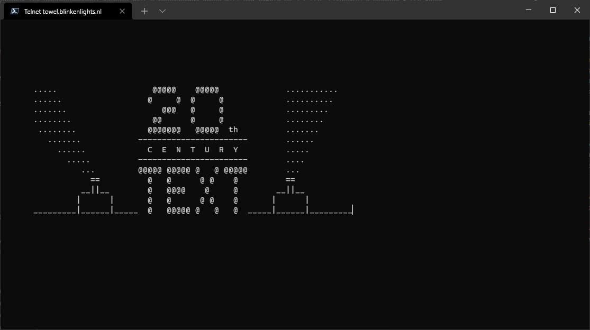
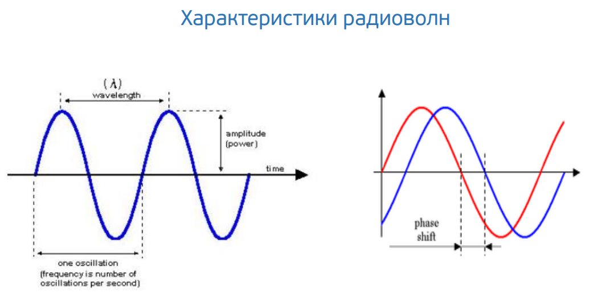
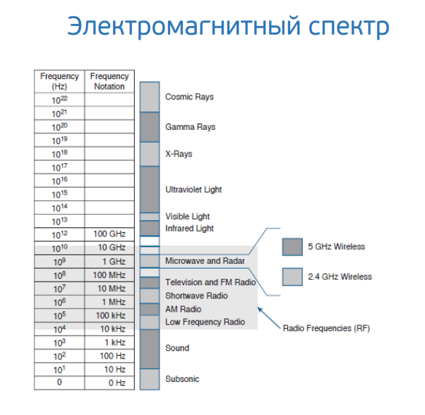
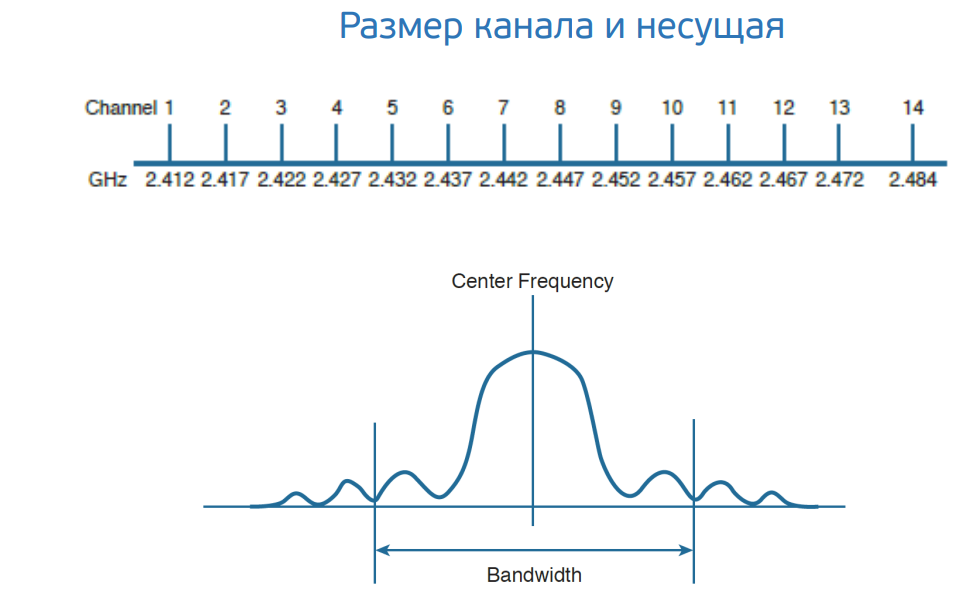
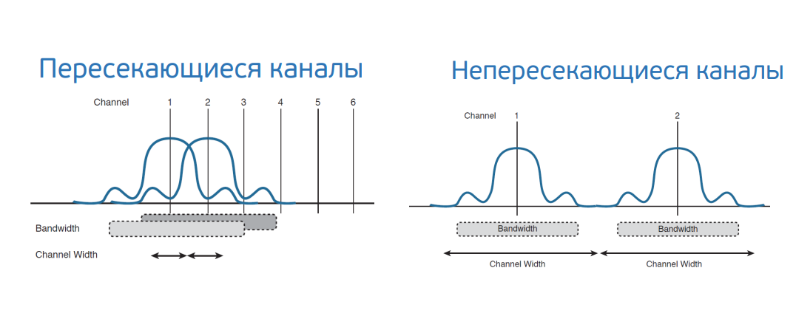
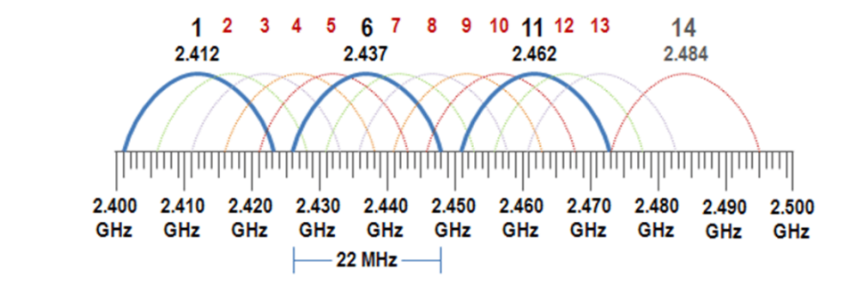
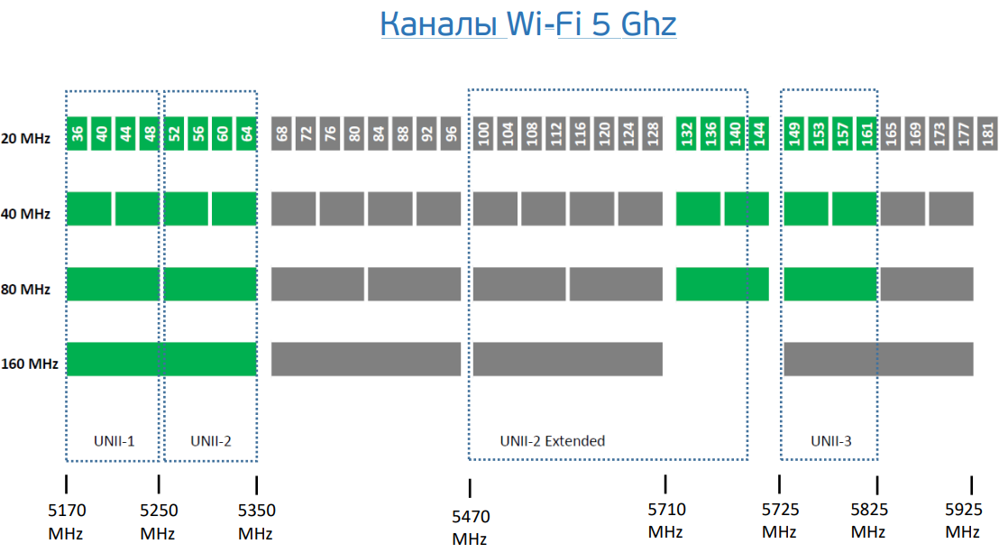

# Ответы

0.  Этот блок прям мое - 10 лет в связи :)

---

1. Необязательное задание:
можно посмотреть целый фильм в консоли `telnet towel.blinkenlights.nl` :)

Купил пива, чисов посмотрел :)



---

2. Узнайте о том, сколько действительно независимых (не пересекающихся) каналов есть в разделяемой среде WiFi при работе на 2.4 ГГц. Стандарты с полосой 5 ГГц более актуальны, но регламенты на 5 ГГц существенно различаются в разных странах, а так же не раз обновлялись. В качестве дополнительного вопроса вне зачета, попробуйте найти актуальный ответ и на этот вопрос.



* 2.4 ГГц. Длинна волны 12.5см
* 5 ГГц. Длинна волны 6 см.

Электромагнитный спектр



Размер канала и несущая



Пересечение каналов



В полосе частот WiFi 2.4GHz для России доступны 3 неперекрывающихся канала: 1, 6, 11.
Данное выделение строится на требовании IEEE по обеспечению минимума в 25MHz для
разнесения центров неперекрывающихся частотных каналов WiFi. При этом ширина канала
составляет 22MHz.

* 1 (2412 МГц)
* 6 (2437 МГц)
* 11 (2462 МГц)

При этом речь идет о каналах шириной 20 МГц. Для 802.11n можно использовать ширину канала 20/40 МГц.
Большая ширина канала обеспечивает большую скорость. 
Т.е. если начинаете использовать ширину в 40 МГц, канал начинает пересекаться с 7 каналами + по 0.5 канала с каждой стороны.

Всего 14 каналов. 



**Каналы Wi-Fi 5 Ghz**



В частотном диапазоне 5 ГГц доступно 23 неперекрывающихся канала по 20 МГц. 
Здесь уже можно использовать не только ширину 20/40 МГц, но и широкий канал в 80 МГц (основной + вспомогательный).

* Первый блок каналов UNII-1 (Lower, нижний) - частота от 5180 до 5240, доступные непересекающиеся каналы по 20 МГц: 36 40 44 48 
* Второй блок UNII-2 (Middle, средний) - частота от 5260 до 5320, доступные непересекающиеся каналы по 20 МГц: 52 56 60 64 
* Третий блок UNII-2 (Extended, расширенный) - частота от 5500 до 5700, доступные непересекающиеся каналы по 20 МГц: 100 104 108 112 116 120 124 128 132 136 140 
* Четвертый блок UNII-3 - частота от 5745 до 5805, доступные непересекающиеся каналы по 20 МГц: 149 153 157 161 

Отдельно существуют 3 группы каналов: 

* Japan (каналы: 8, 12, 16; диапазон 5040-5080) 
* US Public Safety (каналы: 184, 188, 192, 196; диапазон 4920-4980) 
* ISM (канал 165, частота 5825)

Стандартом 802.11ac предусмотрено использование групп UNII-1, UNII-2 (обе) и UNII-3, т.е. суммарно 23 канала. 
Благодаря чему, при использовании ширины канала в 80 МГц, доступно 5 непересекающихся каналов. 
Этой же спецификацией предусмотрена возможность объединения 2-х каналов по 80 МГц, что в итоге дает 160 МГц.

По разрешенным каналам в РФ `total`:
* 20Мгц - 17 каналов
* 40Мгц - 8
* 80Мгц - 4
* 160Мгц -1

---
3. Адрес канального уровня – MAC адрес – это 6 байт, первые 3 из которых называются OUI – Organizationally Unique Identifier или уникальный идентификатор организации. Какому производителю принадлежит MAC `38:f9:d3:55:55:79`?

```bash
38-F9-D3 (hex)
Apple, Inc.
1 Infinite Loop
Cupertino CA 95014
US
Размер диапазона: MA-L
```
---
4. Каким будет payload TCP сегмента, если Ethernet MTU задан в 9001 байт, размер заголовков IPv4 – 20 байт, а TCP – 32 байта?
```bash
TCP Segment = 8981 (MTU - Ethernet Header)
```
---
5. Может ли во флагах TCP одновременно быть установлены флаги SYN и FIN при штатном режиме работы сети? Почему да или нет?
```
Нет не могут, так как SYN - начинает соединение, а FIN завершает, 
Одним пакетом нельзя одновременно и открыть и закрыть сессию.
```
---
6. `ss -ula sport = :53` на хосте имеет следующий вывод:

```bash
State           Recv-Q          Send-Q                   Local Address:Port                     Peer Address:Port          Process
UNCONN          0               0                        127.0.0.53%lo:domain                        0.0.0.0:*
```
---
7. Почему в `State` присутствует только `UNCONN`, и может ли там присутствовать, например, `TIME-WAIT`?

* UNCONN - соединение не установлено,
* Time-wait - это состояние когда сокет отправил подтверждение о получении завершения соединение и ждет, что сообщение доставлено.
```bash
-u (UDP порт) - он не использует предварительные пакеты для соединения и синхронизации, 
как следствие и для разрыва соединения ему не нужно ждать завершения сессии.
```
---
8. Обладая знаниями о том, как штатным образом завершается соединение (FIN от инициатора, FIN-ACK от ответчика, ACK от инициатора), опишите в каких состояниях будет находиться TCP соединение в каждый момент времени на клиенте и на сервере при завершении. Схема переходов состояния соединения вам в этом поможет.
```bash
                    Client           Server 
                 ESTABLESHED      ESTABLESHED
1. >> FIN        FIN WAIT 1   >   CLOSE WAIT
2. << FIN-ACC    FIN WAIT 2   >   CLOSE WAIT 
3. >> ACK        TIME WAIT    <   LAST ACK
                 CLOSED       >   CLOSED
```
---
9. TCP порт – 16 битное число. Предположим, 2 находящихся в одной сети хоста устанавливают между собой соединения. Каким будет теоретическое максимальное число соединений, ограниченное только лишь параметрами L4, которое параллельно может установить клиент с одного IP адреса к серверу с одним IP адресом? Сколько соединений сможет обслужить сервер от одного клиента? А если клиентов больше одного?
```bash
Максимальное число портов = 65535 (max в 16 бит)
Максимальное число соединений от одного клиента для сервера может быть = 65535 

Вторая часть вопроса с подвохом....
* может быть открыт 1 порт на каждого клиента и слушать 65535 соединений клиента
* Уникальным должна быть пара SERVER_IP:PORT - Client_IP:PORT 
Итого может быть 65535 клиентов, и с каждым 65535 соединений, но тут может не хватить ресурсов операционой системы)
```
---

10. Может ли сложиться ситуация, при которой большое число соединений TCP на хосте находятся в состоянии  `TIME-WAIT`? Если да, то является ли она хорошей или плохой? Подкрепите свой ответ пояснением той или иной оценки.
```bash
Да может, при частом коннекте и дисконнекте создается новая сессия и порт.

Старая сеесия какое то время лежит в "спячке", а новая сессия может стартануть раньше чез закроется предыдущая.
При большом количествании таких передергиваний будет накопление портов в "спячке", что приводит к расходу ресурсов.
Хуже всего, если все идет к 1й службе и может так случится, что кончатся порты.

Как избежать? Как вариант, установить время жизни старых сессий.
```
---
11. Чем особенно плоха фрагментация UDP относительно фрагментации TCP?
```bash
Если один из фрагментов умер по пути, то необходимо перепослать весь пакет заново,
но как как UDP не контролит ошибки, то просто возникает потеря.

Зачастую такая печаль на IPTV и SIP телефонии, когда "канал связи" неисправен.
```
---
12. Если бы вы строили систему удаленного сбора логов, то есть систему, в которой несколько хостов отправяют на центральный узел генерируемые приложениями логи (предположим, что логи – текстовая информация), какой протокол транспортного уровня вы выбрали бы и почему? Проверьте ваше предположение самостоятельно, узнав о стандартном протоколе syslog.
```bash
Очевидно TCP, так как реализован механизм гарантированной доставки пакетов.
```
---
13. Сколько портов TCP находится в состоянии прослушивания на вашей виртуальной машине с Ubuntu, и каким процессам они принадлежат?
```bash
vagrant@vagrant:~$ sudo ss  state listening -t -p
Recv-Q  Send-Q   Local Address:Port       Peer Address:Port  Process
0       4096     127.0.0.53%lo:domain          0.0.0.0:*      users:(("systemd-resolve",pid=590,fd=13))
0       128            0.0.0.0:ssh             0.0.0.0:*      users:(("sshd",pid=749,fd=3))
0       4096         127.0.0.1:8125            0.0.0.0:*      users:(("netdata",pid=735,fd=32))
0       4096           0.0.0.0:19999           0.0.0.0:*      users:(("netdata",pid=735,fd=4))
0       4096           0.0.0.0:sunrpc          0.0.0.0:*      users:(("rpcbind",pid=589,fd=4),("systemd",pid=1,fd=35))
0       128               [::]:ssh                [::]:*      users:(("sshd",pid=749,fd=4))
0       4096             [::1]:8125               [::]:*      users:(("netdata",pid=735,fd=29))
0       4096                 *:9100                  *:*      users:(("node_exporter",pid=736,fd=3))
0       4096              [::]:sunrpc             [::]:*      users:(("rpcbind",pid=589,fd=6),("systemd",pid=1,fd=37))
```
Вроде все понятно без комментариев
---
14. Какой ключ нужно добавить в `tcpdump`, чтобы он начал выводить не только заголовки, но и содержимое фреймов в текстовом виде? А в текстовом и шестнадцатиричном?

В текстовом виде `ASCII`

```bash
vagrant@vagrant:~$ sudo tcpdump -A -c 1
tcpdump: verbose output suppressed, use -v or -vv for full protocol decode
listening on eth0, link-type EN10MB (Ethernet), capture size 262144 bytes
20:41:21.266235 IP WSIBU0010979.SI.RT.RU.ssh > _gateway.65264: Flags [P.], seq 2061698006:2061698170, ack 3586923, win 64032, length 164
E.....@.@.JS
...
.......z....6.kP.. ....-.....x.Bv..D..Z...nf.Jw....[A*....9q_.Pbg6....}..J.$FT[.;.>.i.=2....P.8.i~Y...:n.3:0'....(......+0.B.G:.f..>.._....&..!-%...t.i..Tf.6
r*O.}4K.\.Z..f.6.,...../..aeK
1 packet captured
8 packets received by filter
0 packets dropped by kernel
```
В `HEX`

```bash
vagrant@vagrant:~$ sudo tcpdump -x -c 1
tcpdump: verbose output suppressed, use -v or -vv for full protocol decode
listening on eth0, link-type EN10MB (Ethernet), capture size 262144 bytes
20:42:46.361941 IP WSIBU0010979.SI.RT.RU.ssh > _gateway.65264: Flags [P.], seq 2061698662:2061698698, ack 3587067, win 64032, length 36
        0x0000:  4510 004c d7bf 4000 4006 4acc 0a00 020f
        0x0010:  0a00 0202 0016 fef0 7ae3 0666 0036 bbfb
        0x0020:  5018 fa20 184f 0000 dd00 9f04 5204 e605
        0x0030:  676e c616 2329 f2b3 8733 5262 cc1e eafa
        0x0040:  1bce d2b9 7682 74f6 c0f2 ff1d
1 packet captured
15 packets received by filter
0 packets dropped by kernel
```

15. Попробуйте собрать дамп трафика с помощью `tcpdump` на основном интерфейсе вашей виртуальной машины и посмотреть его через tshark или Wireshark (можно ограничить число пакетов `-c 100`). Встретились ли вам какие-то установленные флаги Internet Protocol (не флаги TCP, а флаги IP)? Узнайте, какие флаги бывают. Как на самом деле называется стандарт Ethernet, фреймы которого попали в ваш дамп? Можно ли где-то в дампе увидеть OUI?

```bash
Впервые этот стандарт был опубликован 30 сентября 1980 года.
Ethernet называется Ethernet Version 2 или Ethernet-кадр II,
ещё называемый DIX (аббревиатура первых букв фирм-разработчиков DEC, Intel, Xerox) 
 ```
Исчерпывающая инфа [тут](https://www.tcpdump.org/manpages/tcpdump.1.html)

Tcpflags - это комбинация S (SYN), F (FIN), P (PUSH), R (RST), U (URG), W (ECN CWR), E (ECN-Echo) или `. ' (ACK) или `none ', если флаги не установлены.

```bash
vagrant@vagrant:~$ sudo tcpdump -c 100
tcpdump: verbose output suppressed, use -v or -vv for full protocol decode
listening on eth0, link-type EN10MB (Ethernet), capture size 262144 bytes
20:50:40.805125 IP WSIBU0010979.SI.RT.RU.ssh > _gateway.65264: Flags [P.], seq 2061715230:2061715330, ack 3589911, win 64032, length 100
20:50:40.805367 IP _gateway.65264 > WSIBU0010979.SI.RT.RU.ssh: Flags [.], ack 100, win 65535, length 0
20:50:40.805695 IP WSIBU0010979.SI.RT.RU.55818 > 10.0.2.3.domain: 39073+ [1au] PTR? 2.2.0.10.in-addr.arpa. (50)
20:50:40.808644 IP 10.0.2.3.domain > WSIBU0010979.SI.RT.RU.55818: 39073 NXDomain 0/1/1 (112)
20:50:40.808750 IP WSIBU0010979.SI.RT.RU.55818 > 10.0.2.3.domain: 39073+ PTR? 2.2.0.10.in-addr.arpa. (39)
20:50:40.812326 IP 10.0.2.3.domain > WSIBU0010979.SI.RT.RU.55818: 39073 NXDomain 0/1/0 (101)
20:50:40.812921 IP WSIBU0010979.SI.RT.RU.ssh > _gateway.65264: Flags [P.], seq 100:192, ack 1, win 64032, length 92
20:50:40.813130 IP WSIBU0010979.SI.RT.RU.56275 > 10.0.2.3.domain: 14046+ [1au] PTR? 3.2.0.10.in-addr.arpa. (50)
20:50:40.813140 IP _gateway.65264 > WSIBU0010979.SI.RT.RU.ssh: Flags [.], ack 192, win 65535, length 0
20:50:40.818033 IP 10.0.2.3.domain > WSIBU0010979.SI.RT.RU.56275: 14046 NXDomain 0/1/1 (112)
20:50:40.818130 IP WSIBU0010979.SI.RT.RU.56275 > 10.0.2.3.domain: 14046+ PTR? 3.2.0.10.in-addr.arpa. (39)
20:50:40.820439 IP 10.0.2.3.domain > WSIBU0010979.SI.RT.RU.56275: 14046 NXDomain 0/1/0 (101)
20:50:40.820987 IP WSIBU0010979.SI.RT.RU.ssh > _gateway.65264: Flags [P.], seq 192:380, ack 1, win 64032, length 188
20:50:40.821113 IP WSIBU0010979.SI.RT.RU.ssh > _gateway.65264: Flags [P.], seq 380:448, ack 1, win 64032, length 68
20:50:40.821186 IP _gateway.65264 > WSIBU0010979.SI.RT.RU.ssh: Flags [.], ack 380, win 65535, length 0
20:50:40.821254 IP WSIBU0010979.SI.RT.RU.ssh > _gateway.65264: Flags [P.], seq 448:500, ack 1, win 64032, length 52
20:50:40.821310 IP _gateway.65264 > WSIBU0010979.SI.RT.RU.ssh: Flags [.], ack 448, win 65535, length 0
20:50:40.821393 IP _gateway.65264 > WSIBU0010979.SI.RT.RU.ssh: Flags [.], ack 500, win 65535, length 0
20:50:40.821439 IP WSIBU0010979.SI.RT.RU.ssh > _gateway.65264: Flags [P.], seq 500:576, ack 1, win 64032, length 76
20:50:40.821623 IP _gateway.65264 > WSIBU0010979.SI.RT.RU.ssh: Flags [.], ack 576, win 65535, length 0
20:50:40.821657 IP WSIBU0010979.SI.RT.RU.ssh > _gateway.65264: Flags [P.], seq 576:636, ack 1, win 64032, length 60
20:50:40.821851 IP WSIBU0010979.SI.RT.RU.ssh > _gateway.65264: Flags [P.], seq 636:696, ack 1, win 64032, length 60
20:50:40.821855 IP _gateway.65264 > WSIBU0010979.SI.RT.RU.ssh: Flags [.], ack 636, win 65535, length 0
20:50:40.821998 IP _gateway.65264 > WSIBU0010979.SI.RT.RU.ssh: Flags [.], ack 696, win 65535, length 0
20:50:40.821999 IP WSIBU0010979.SI.RT.RU.ssh > _gateway.65264: Flags [P.], seq 696:756, ack 1, win 64032, length 60
20:50:40.822175 IP WSIBU0010979.SI.RT.RU.ssh > _gateway.65264: Flags [P.], seq 756:816, ack 1, win 64032, length 60
20:50:40.822176 IP _gateway.65264 > WSIBU0010979.SI.RT.RU.ssh: Flags [.], ack 756, win 65535, length 0
20:50:40.822346 IP WSIBU0010979.SI.RT.RU.ssh > _gateway.65264: Flags [P.], seq 816:876, ack 1, win 64032, length 60
20:50:40.822360 IP _gateway.65264 > WSIBU0010979.SI.RT.RU.ssh: Flags [.], ack 816, win 65535, length 0
20:50:40.822533 IP _gateway.65264 > WSIBU0010979.SI.RT.RU.ssh: Flags [.], ack 876, win 65535, length 0
20:50:40.822598 IP WSIBU0010979.SI.RT.RU.ssh > _gateway.65264: Flags [P.], seq 876:936, ack 1, win 64032, length 60
20:50:40.822749 IP _gateway.65264 > WSIBU0010979.SI.RT.RU.ssh: Flags [.], ack 936, win 65535, length 0
20:50:40.822796 IP WSIBU0010979.SI.RT.RU.ssh > _gateway.65264: Flags [P.], seq 936:980, ack 1, win 64032, length 44
20:50:40.822975 IP _gateway.65264 > WSIBU0010979.SI.RT.RU.ssh: Flags [.], ack 980, win 65535, length 0
20:50:40.823054 IP WSIBU0010979.SI.RT.RU.ssh > _gateway.65264: Flags [P.], seq 980:1040, ack 1, win 64032, length 60
20:50:40.823146 IP WSIBU0010979.SI.RT.RU.ssh > _gateway.65264: Flags [P.], seq 1040:1092, ack 1, win 64032, length 52
20:50:40.823230 IP WSIBU0010979.SI.RT.RU.ssh > _gateway.65264: Flags [P.], seq 1092:1136, ack 1, win 64032, length 44
20:50:40.823237 IP _gateway.65264 > WSIBU0010979.SI.RT.RU.ssh: Flags [.], ack 1040, win 65535, length 0
20:50:40.823303 IP WSIBU0010979.SI.RT.RU.ssh > _gateway.65264: Flags [P.], seq 1136:1188, ack 1, win 64032, length 52
20:50:40.823392 IP _gateway.65264 > WSIBU0010979.SI.RT.RU.ssh: Flags [.], ack 1092, win 65535, length 0
20:50:40.823392 IP _gateway.65264 > WSIBU0010979.SI.RT.RU.ssh: Flags [.], ack 1136, win 65535, length 0
20:50:40.823470 IP WSIBU0010979.SI.RT.RU.ssh > _gateway.65264: Flags [P.], seq 1188:1264, ack 1, win 64032, length 76
20:50:40.823478 IP _gateway.65264 > WSIBU0010979.SI.RT.RU.ssh: Flags [.], ack 1188, win 65535, length 0
20:50:40.823641 IP _gateway.65264 > WSIBU0010979.SI.RT.RU.ssh: Flags [.], ack 1264, win 65535, length 0
20:50:40.823741 IP WSIBU0010979.SI.RT.RU.ssh > _gateway.65264: Flags [P.], seq 1264:1364, ack 1, win 64032, length 100
20:50:40.824136 IP _gateway.65264 > WSIBU0010979.SI.RT.RU.ssh: Flags [.], ack 1364, win 65535, length 0
20:50:40.824153 IP WSIBU0010979.SI.RT.RU.ssh > _gateway.65264: Flags [P.], seq 1364:1432, ack 1, win 64032, length 68
20:50:40.824296 IP WSIBU0010979.SI.RT.RU.ssh > _gateway.65264: Flags [P.], seq 1432:1492, ack 1, win 64032, length 60
20:50:40.824338 IP _gateway.65264 > WSIBU0010979.SI.RT.RU.ssh: Flags [.], ack 1432, win 65535, length 0
20:50:40.824432 IP WSIBU0010979.SI.RT.RU.ssh > _gateway.65264: Flags [P.], seq 1492:1544, ack 1, win 64032, length 52
20:50:40.824491 IP _gateway.65264 > WSIBU0010979.SI.RT.RU.ssh: Flags [.], ack 1492, win 65535, length 0
20:50:40.824615 IP WSIBU0010979.SI.RT.RU.ssh > _gateway.65264: Flags [P.], seq 1544:1604, ack 1, win 64032, length 60
20:50:40.824660 IP _gateway.65264 > WSIBU0010979.SI.RT.RU.ssh: Flags [.], ack 1544, win 65535, length 0
20:50:40.824769 IP WSIBU0010979.SI.RT.RU.ssh > _gateway.65264: Flags [P.], seq 1604:1664, ack 1, win 64032, length 60
20:50:40.824875 IP _gateway.65264 > WSIBU0010979.SI.RT.RU.ssh: Flags [.], ack 1604, win 65535, length 0
20:50:40.824927 IP WSIBU0010979.SI.RT.RU.ssh > _gateway.65264: Flags [P.], seq 1664:1716, ack 1, win 64032, length 52
20:50:40.824956 IP _gateway.65264 > WSIBU0010979.SI.RT.RU.ssh: Flags [.], ack 1664, win 65535, length 0
20:50:40.825089 IP WSIBU0010979.SI.RT.RU.ssh > _gateway.65264: Flags [P.], seq 1716:1784, ack 1, win 64032, length 68
20:50:40.825103 IP _gateway.65264 > WSIBU0010979.SI.RT.RU.ssh: Flags [.], ack 1716, win 65535, length 0
20:50:40.825242 IP WSIBU0010979.SI.RT.RU.ssh > _gateway.65264: Flags [P.], seq 1784:1836, ack 1, win 64032, length 52
20:50:40.825247 IP _gateway.65264 > WSIBU0010979.SI.RT.RU.ssh: Flags [.], ack 1784, win 65535, length 0
20:50:40.825374 IP WSIBU0010979.SI.RT.RU.ssh > _gateway.65264: Flags [P.], seq 1836:1896, ack 1, win 64032, length 60
20:50:40.825407 IP _gateway.65264 > WSIBU0010979.SI.RT.RU.ssh: Flags [.], ack 1836, win 65535, length 0
20:50:40.825522 IP WSIBU0010979.SI.RT.RU.ssh > _gateway.65264: Flags [P.], seq 1896:1964, ack 1, win 64032, length 68
20:50:40.825527 IP _gateway.65264 > WSIBU0010979.SI.RT.RU.ssh: Flags [.], ack 1896, win 65535, length 0
20:50:40.825672 IP WSIBU0010979.SI.RT.RU.ssh > _gateway.65264: Flags [P.], seq 1964:2024, ack 1, win 64032, length 60
20:50:40.825735 IP _gateway.65264 > WSIBU0010979.SI.RT.RU.ssh: Flags [.], ack 1964, win 65535, length 0
20:50:40.825819 IP WSIBU0010979.SI.RT.RU.ssh > _gateway.65264: Flags [P.], seq 2024:2084, ack 1, win 64032, length 60
20:50:40.826029 IP WSIBU0010979.SI.RT.RU.ssh > _gateway.65264: Flags [P.], seq 2084:2128, ack 1, win 64032, length 44
20:50:40.826188 IP WSIBU0010979.SI.RT.RU.ssh > _gateway.65264: Flags [P.], seq 2128:2180, ack 1, win 64032, length 52
20:50:40.826340 IP WSIBU0010979.SI.RT.RU.ssh > _gateway.65264: Flags [P.], seq 2180:2232, ack 1, win 64032, length 52
20:50:40.826472 IP WSIBU0010979.SI.RT.RU.ssh > _gateway.65264: Flags [P.], seq 2232:2276, ack 1, win 64032, length 44
20:50:40.826637 IP WSIBU0010979.SI.RT.RU.ssh > _gateway.65264: Flags [P.], seq 2276:2320, ack 1, win 64032, length 44
20:50:40.826763 IP WSIBU0010979.SI.RT.RU.ssh > _gateway.65264: Flags [P.], seq 2320:2372, ack 1, win 64032, length 52
20:50:40.826924 IP WSIBU0010979.SI.RT.RU.ssh > _gateway.65264: Flags [P.], seq 2372:2416, ack 1, win 64032, length 44
20:50:40.827080 IP WSIBU0010979.SI.RT.RU.ssh > _gateway.65264: Flags [P.], seq 2416:2460, ack 1, win 64032, length 44
20:50:40.828886 IP _gateway.65264 > WSIBU0010979.SI.RT.RU.ssh: Flags [.], ack 2024, win 65535, length 0
20:50:40.828886 IP _gateway.65264 > WSIBU0010979.SI.RT.RU.ssh: Flags [.], ack 2084, win 65535, length 0
20:50:40.828905 IP WSIBU0010979.SI.RT.RU.ssh > _gateway.65264: Flags [P.], seq 2460:2512, ack 1, win 64032, length 52
20:50:40.829004 IP _gateway.65264 > WSIBU0010979.SI.RT.RU.ssh: Flags [.], ack 2128, win 65535, length 0
20:50:40.829004 IP _gateway.65264 > WSIBU0010979.SI.RT.RU.ssh: Flags [.], ack 2180, win 65535, length 0
20:50:40.829004 IP _gateway.65264 > WSIBU0010979.SI.RT.RU.ssh: Flags [.], ack 2232, win 65535, length 0
20:50:40.829075 IP WSIBU0010979.SI.RT.RU.ssh > _gateway.65264: Flags [P.], seq 2512:2580, ack 1, win 64032, length 68
20:50:40.829123 IP _gateway.65264 > WSIBU0010979.SI.RT.RU.ssh: Flags [.], ack 2276, win 65535, length 0
20:50:40.829123 IP _gateway.65264 > WSIBU0010979.SI.RT.RU.ssh: Flags [.], ack 2320, win 65535, length 0
20:50:40.829123 IP _gateway.65264 > WSIBU0010979.SI.RT.RU.ssh: Flags [.], ack 2372, win 65535, length 0
20:50:40.829215 IP _gateway.65264 > WSIBU0010979.SI.RT.RU.ssh: Flags [.], ack 2416, win 65535, length 0
20:50:40.829215 IP _gateway.65264 > WSIBU0010979.SI.RT.RU.ssh: Flags [.], ack 2460, win 65535, length 0
20:50:40.829223 IP WSIBU0010979.SI.RT.RU.ssh > _gateway.65264: Flags [P.], seq 2580:2632, ack 1, win 64032, length 52
20:50:40.829353 IP WSIBU0010979.SI.RT.RU.ssh > _gateway.65264: Flags [P.], seq 2632:2700, ack 1, win 64032, length 68
20:50:40.829369 IP _gateway.65264 > WSIBU0010979.SI.RT.RU.ssh: Flags [.], ack 2512, win 65535, length 0
20:50:40.829369 IP _gateway.65264 > WSIBU0010979.SI.RT.RU.ssh: Flags [.], ack 2580, win 65535, length 0
20:50:40.829369 IP _gateway.65264 > WSIBU0010979.SI.RT.RU.ssh: Flags [.], ack 2632, win 65535, length 0
20:50:40.829477 IP WSIBU0010979.SI.RT.RU.ssh > _gateway.65264: Flags [P.], seq 2700:2744, ack 1, win 64032, length 44
20:50:40.829511 IP _gateway.65264 > WSIBU0010979.SI.RT.RU.ssh: Flags [.], ack 2700, win 65535, length 0
20:50:40.829518 IP WSIBU0010979.SI.RT.RU.ssh > _gateway.65264: Flags [P.], seq 2744:2788, ack 1, win 64032, length 44
20:50:40.829640 IP WSIBU0010979.SI.RT.RU.ssh > _gateway.65264: Flags [P.], seq 2788:2840, ack 1, win 64032, length 52
20:50:40.829693 IP _gateway.65264 > WSIBU0010979.SI.RT.RU.ssh: Flags [.], ack 2744, win 65535, length 0
20:50:40.829693 IP _gateway.65264 > WSIBU0010979.SI.RT.RU.ssh: Flags [.], ack 2788, win 65535, length 0
20:50:40.829798 IP _gateway.65264 > WSIBU0010979.SI.RT.RU.ssh: Flags [.], ack 2840, win 65535, length 0
100 packets captured
120 packets received by filter
0 packets dropped by kernel
```

 ---

## Как сдавать задания

Обязательными к выполнению являются задачи без указания звездочки. Их выполнение необходимо для получения зачета и диплома о профессиональной переподготовке.

Задачи со звездочкой (*) являются дополнительными задачами и/или задачами повышенной сложности. Они не являются обязательными к выполнению, но помогут вам глубже понять тему.

Домашнее задание выполните в файле readme.md в github репозитории. В личном кабинете отправьте на проверку ссылку на .md-файл в вашем репозитории.

Также вы можете выполнить задание в [Google Docs](https://docs.google.com/document/u/0/?tgif=d) и отправить в личном кабинете на проверку ссылку на ваш документ.
Название файла Google Docs должно содержать номер лекции и фамилию студента. Пример названия: "1.1. Введение в DevOps — Сусанна Алиева".

Если необходимо прикрепить дополнительные ссылки, просто добавьте их в свой Google Docs.

Перед тем как выслать ссылку, убедитесь, что ее содержимое не является приватным (открыто на комментирование всем, у кого есть ссылка), иначе преподаватель не сможет проверить работу. Чтобы это проверить, откройте ссылку в браузере в режиме инкогнито.

[Как предоставить доступ к файлам и папкам на Google Диске](https://support.google.com/docs/answer/2494822?hl=ru&co=GENIE.Platform%3DDesktop)

[Как запустить chrome в режиме инкогнито ](https://support.google.com/chrome/answer/95464?co=GENIE.Platform%3DDesktop&hl=ru)

[Как запустить  Safari в режиме инкогнито ](https://support.apple.com/ru-ru/guide/safari/ibrw1069/mac)

Любые вопросы по решению задач задавайте в чате Slack.

---
