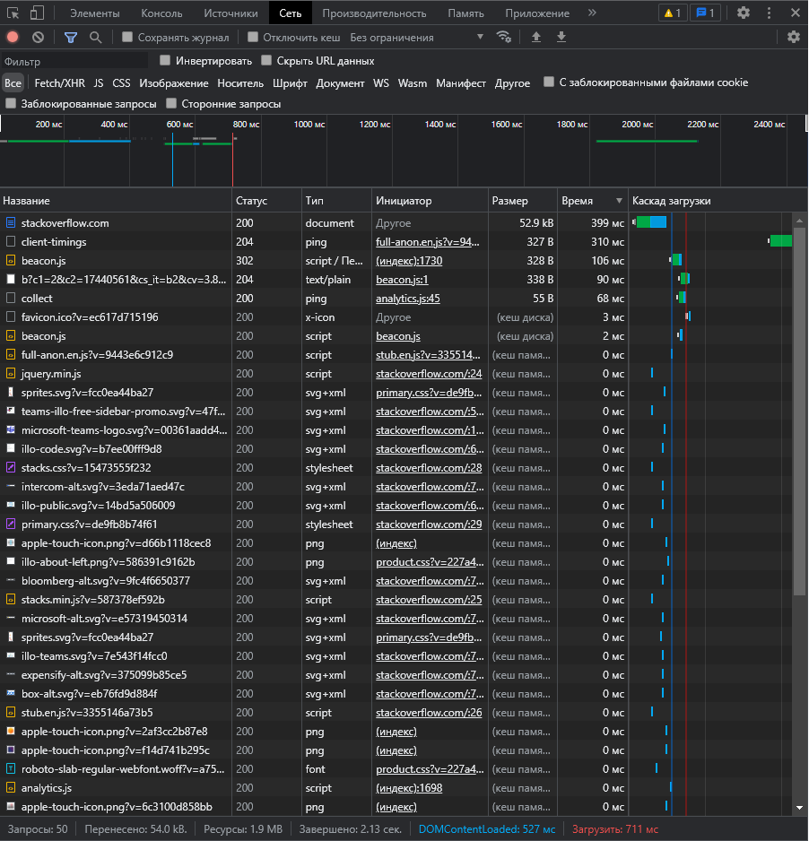

# Решение домашней работы

1. Работа c HTTP через телнет.
- Подключитесь утилитой телнет к сайту stackoverflow.com
`telnet stackoverflow.com 80`
```bash
# telnet stackoverflow.com 80
Connection to stackoverflow.com:80 - ok
```
- отправьте HTTP запрос
- отправьте HTTP запрос
```bash
GET /questions HTTP/1.0
HOST: stackoverflow.com
[press enter]
[press enter]
```
Ответ
```http request
# GET /questions HTTP/1.0
sorry sending commands to host disabled because assholes using service to attack others
# HOST: stackoverflow.com
sorry sending commands to host disabled because assholes using service to attack others
```
- В ответе укажите полученный HTTP код, что он означает?
```
Извините, отправка команд на хост отключена, потому что придурки используют сервис для нападения на других
```
---
2. Повторите задание 1 в браузере, используя консоль разработчика F12.
- откройте вкладку `Network`
- отправьте запрос http://stackoverflow.com
- найдите первый ответ HTTP сервера, откройте вкладку `Headers`
- укажите в ответе полученный HTTP код.
- проверьте время загрузки страницы, какой запрос обрабатывался дольше всего?
- приложите скриншот консоли браузера в ответ.

```
Задание полностью выполнить невозможно "sorry sending commands to host disabled because assholes using service to attack others"
```
Наиболее продолжительные ответы отфильтрованы


---
3. Какой IP адрес у вас в интернете?
```
Белый, статический IPv4: 5.137.X.X сообщить полностью считаю не безопасным.
```
---
4. Какому провайдеру принадлежит ваш IP адрес? Какой автономной системе AS? Воспользуйтесь утилитой `whois`
```
Ростелеком

route: 5.137.0.0/16
descr: Rostelecom networks
origin: AS12389
mnt-by: ROSTELECOM-MNT
created: 2018-09-28T12:58:15Z
last-modified: 2018-09-28T12:58:15Z
source: RIPE # Filtered
```
---
5. Через какие сети проходит пакет, отправленный с вашего компьютера на адрес 8.8.8.8? Через какие AS? Воспользуйтесь утилитой `traceroute`

С локального сети, через брас и ргр и далее на внешку
```
  1    <1 мс    <1 мс    <1 мс  192.168.0.1
  2     4 ms     4 ms     2 ms  nvsk-bras6.sib.ip.rostelecom.ru [213.228.116.18]
  3     9 ms     5 ms     2 ms  ae6.nvsk-rgr5.sib.ip.rostelecom.ru [213.228.109.38]
  4    45 ms    45 ms    46 ms  87.226.183.89
  5    46 ms    45 ms    46 ms  5.143.253.105
  6     *        *        *     Превышен интервал ожидания для запроса.
  7     *        *        *     Превышен интервал ожидания для запроса.
  8    58 ms    59 ms    59 ms  108.170.235.204
  9    58 ms    64 ms    57 ms  142.250.236.77
 10     *        *        *     Превышен интервал ожидания для запроса.

```
---
6. Повторите задание 5 в утилите `mtr`. На каком участке наибольшая задержка - delay?

Наибольшая задержка 108.170.235.204 

```vagrant (10.0.2.15)                                                                            2021-12-15T22:05:17+0000
Keys:  Help   Display mode   Restart statistics   Order of fields   quit
                                                                               Packets               Pings
 Host                                                                        Loss%   Snt   Last   Avg  Best  Wrst StDev
 1. _gateway                                                                  0.0%     5    0.3   0.3   0.2   0.4   0.1
 2. 192.168.0.1                                                               0.0%     5    1.2   1.2   0.7   1.5   0.3
 3. nvsk-bras6.sib.ip.rostelecom.ru                                           0.0%     5    7.9   6.1   4.5   7.9   1.3
 4. ae6.nvsk-rgr5.sib.ip.rostelecom.ru                                        0.0%     5    4.3   4.8   3.1   7.2   1.6
 5. 87.226.183.89                                                             0.0%     5   46.3  45.4  44.7  46.3   0.7
 6. 5.143.253.105                                                             0.0%     5   45.3  46.8  45.3  48.1   1.2
 7. (waiting for reply)
 8. (waiting for reply)
 9. 108.170.235.204                                                           0.0%     5   62.4  64.2  62.4  66.1   1.3
10. 142.250.236.77                                                            0.0%     5   60.8  60.8  59.5  61.4   0.8
11. (waiting for reply)
12. (waiting for reply)
13. (waiting for reply)
14. (waiting for reply)
15. (waiting for reply)
16. (waiting for reply)
17. (waiting for reply)
18. (waiting for reply)
19. dns.google                                                               66.7%     4   57.3  57.3  57.3  57.3   0.0
```
---

7. Какие DNS сервера отвечают за доменное имя dns.google? Какие A записи? воспользуйтесь утилитой `dig`

**DNS сервера:**

* ns3.zdns.google.
* ns1.zdns.google.
* ns2.zdns.google.
* ns4.zdns.google.
```bash
vagrant@vagrant:~$ dig -t ns dns.google

; <<>> DiG 9.16.1-Ubuntu <<>> -t ns dns.google
;; global options: +cmd
;; Got answer:
;; ->>HEADER<<- opcode: QUERY, status: NOERROR, id: 29499
;; flags: qr rd ra; QUERY: 1, ANSWER: 4, AUTHORITY: 0, ADDITIONAL: 1

;; OPT PSEUDOSECTION:
; EDNS: version: 0, flags:; udp: 65494
;; QUESTION SECTION:
;dns.google.                    IN      NS

;; ANSWER SECTION:
dns.google.             8854    IN      NS      ns3.zdns.google.
dns.google.             8854    IN      NS      ns1.zdns.google.
dns.google.             8854    IN      NS      ns2.zdns.google.
dns.google.             8854    IN      NS      ns4.zdns.google.

;; Query time: 8 msec
;; SERVER: 127.0.0.53#53(127.0.0.53)
;; WHEN: Wed Dec 15 22:08:15 UTC 2021
;; MSG SIZE  rcvd: 116
```
A-записи:
* 8.8.4.4
* 8.8.8.8

```bash
vagrant@vagrant:~$ dig dns.google

; <<>> DiG 9.16.1-Ubuntu <<>> dns.google
;; global options: +cmd
;; Got answer:
;; ->>HEADER<<- opcode: QUERY, status: NOERROR, id: 1450
;; flags: qr rd ra; QUERY: 1, ANSWER: 2, AUTHORITY: 0, ADDITIONAL: 1

;; OPT PSEUDOSECTION:
; EDNS: version: 0, flags:; udp: 65494
;; QUESTION SECTION:
;dns.google.                    IN      A

;; ANSWER SECTION:
dns.google.             640     IN      A       8.8.4.4
dns.google.             640     IN      A       8.8.8.8

;; Query time: 12 msec
;; SERVER: 127.0.0.53#53(127.0.0.53)
;; WHEN: Wed Dec 15 22:10:12 UTC 2021
;; MSG SIZE  rcvd: 71
```

8. Проверьте PTR записи для IP адресов из задания 7. Какое доменное имя привязано к IP? воспользуйтесь утилитой `dig`

```bash
vagrant@vagrant:~$ dig -x 216.239.34.114 +short
ns2.zdns.google.
```
В качестве ответов на вопросы можно приложите лог выполнения команд в консоли или скриншот полученных результатов.
