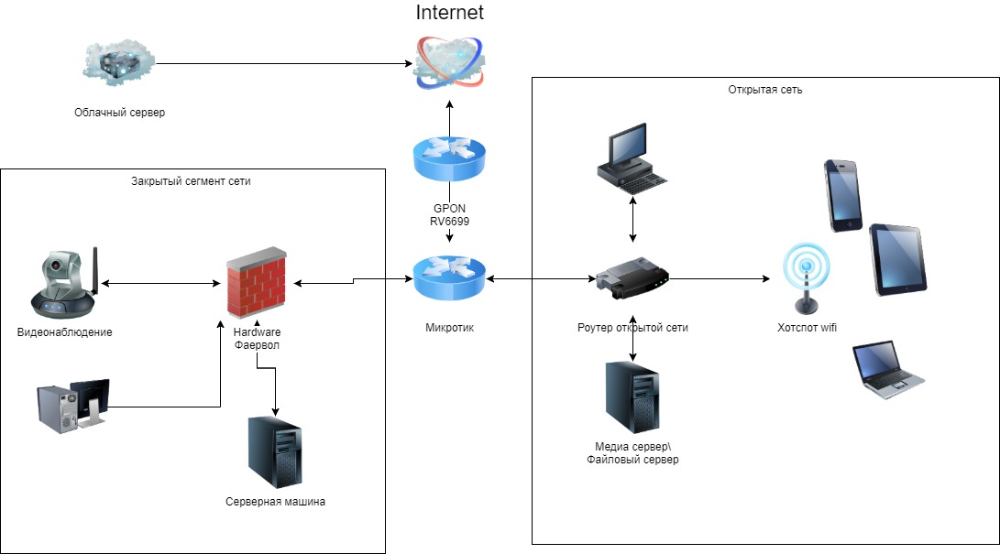

# Домашнее задание к занятию "3.8. Компьютерные сети, лекция 3"

1. Подключитесь к публичному маршрутизатору в интернет. Найдите маршрут к вашему публичному IP
```
telnet route-views.routeviews.org
Username: rviews
```
`show ip route 5.137.X.X/32`
```bash
route-views>show ip route 5.137.X.X
Routing entry for 5.137.0.0/16
  Known via "bgp 6447", distance 20, metric 0
  Tag 6939, type external
  Last update from 64.71.137.241 2w2d ago
  Routing Descriptor Blocks:
  * 64.71.137.241, from 64.71.137.241, 2w2d ago
      Route metric is 0, traffic share count is 1
      AS Hops 2
      Route tag 6939
      MPLS label: none
```
`show bgp 5.137.182.97/32`
```bash
BGP routing table entry for 5.137.0.0/16, version 1388607592
Paths: (23 available, best #22, table default)
  Not advertised to any peer
  Refresh Epoch 1
  20912 3257 3356 12389
    212.66.96.126 from 212.66.96.126 (212.66.96.126)
      Origin IGP, localpref 100, valid, external
      Community: 3257:8070 3257:30515 3257:50001 3257:53900 3257:53902 20912:65004
      path 7FE02C326D50 RPKI State not found
      rx pathid: 0, tx pathid: 0
  Refresh Epoch 1
  3333 1103 12389
    193.0.0.56 from 193.0.0.56 (193.0.0.56)
      Origin IGP, localpref 100, valid, external
      path 7FE02429A478 RPKI State not found
      rx pathid: 0, tx pathid: 0
  Refresh Epoch 1
  8283 1299 12389
    94.142.247.3 from 94.142.247.3 (94.142.247.3)
      Origin IGP, metric 0, localpref 100, valid, external
      Community: 1299:30000 8283:1 8283:101
      unknown transitive attribute: flag 0xE0 type 0x20 length 0x18
        value 0000 205B 0000 0000 0000 0001 0000 205B
              0000 0005 0000 0001
      path 7FE0B569B7C8 RPKI State not found
      rx pathid: 0, tx pathid: 0
  Refresh Epoch 1
  53767 14315 6453 6453 3356 12389
    162.251.163.2 from 162.251.163.2 (162.251.162.3)
      Origin IGP, localpref 100, valid, external
      Community: 14315:5000 53767:5000
      path 7FE0CDF7E7B0 RPKI State not found
      rx pathid: 0, tx pathid: 0
  Refresh Epoch 1
  3356 12389
    4.68.4.46 from 4.68.4.46 (4.69.184.201)
      Origin IGP, metric 0, localpref 100, valid, external
      Community: 3356:2 3356:22 3356:100 3356:123 3356:501 3356:903 3356:2065
      path 7FE0CEB818C8 RPKI State not found
      rx pathid: 0, tx pathid: 0
  Refresh Epoch 1
  20130 6939 12389
    140.192.8.16 from 140.192.8.16 (140.192.8.16)
      Origin IGP, localpref 100, valid, external
      path 7FE14EA40AF0 RPKI State not found
      rx pathid: 0, tx pathid: 0
  Refresh Epoch 1
  57866 3356 12389
    37.139.139.17 from 37.139.139.17 (37.139.139.17)
      Origin IGP, metric 0, localpref 100, valid, external
      Community: 3356:2 3356:22 3356:100 3356:123 3356:501 3356:903 3356:2065
      path 7FE15EE846D8 RPKI State not found
      rx pathid: 0, tx pathid: 0
  Refresh Epoch 1
  3549 3356 12389
    208.51.134.254 from 208.51.134.254 (67.16.168.191)
      Origin IGP, metric 0, localpref 100, valid, external
      Community: 3356:2 3356:22 3356:100 3356:123 3356:501 3356:903 3356:2065 3549:2581 3549:30840
      path 7FE07FF68050 RPKI State not found
      rx pathid: 0, tx pathid: 0
  Refresh Epoch 1
  852 3491 12389
    154.11.12.212 from 154.11.12.212 (96.1.209.43)
      Origin IGP, metric 0, localpref 100, valid, external
      path 7FE0AB9AF988 RPKI State not found
      rx pathid: 0, tx pathid: 0
  Refresh Epoch 1
  101 3491 12389
    209.124.176.223 from 209.124.176.223 (209.124.176.223)
      Origin IGP, localpref 100, valid, external
      Community: 101:20300 101:22100 3491:400 3491:415 3491:9001 3491:9080 3491:9081 3491:9087 3491:62210 3491:62220
      path 7FE18B6CBD08 RPKI State not found
      rx pathid: 0, tx pathid: 0
  Refresh Epoch 1
  2497 12389
    202.232.0.2 from 202.232.0.2 (58.138.96.254)
      Origin IGP, localpref 100, valid, external
      path 7FE166088990 RPKI State not found
      rx pathid: 0, tx pathid: 0
  Refresh Epoch 3
  3303 12389
    217.192.89.50 from 217.192.89.50 (138.187.128.158)
      Origin IGP, localpref 100, valid, external
      Community: 3303:1004 3303:1006 3303:1030 3303:3056
      path 7FE021C54040 RPKI State not found
      rx pathid: 0, tx pathid: 0
  Refresh Epoch 1
  4901 6079 3356 12389
    162.250.137.254 from 162.250.137.254 (162.250.137.254)
      Origin IGP, localpref 100, valid, external
      Community: 65000:10100 65000:10300 65000:10400
      path 7FE09D9E27B8 RPKI State not found
      rx pathid: 0, tx pathid: 0
  Refresh Epoch 1
  7660 2516 12389
    203.181.248.168 from 203.181.248.168 (203.181.248.168)
      Origin IGP, localpref 100, valid, external
      Community: 2516:1050 7660:9003
      path 7FE1332164B8 RPKI State not found
      rx pathid: 0, tx pathid: 0
  Refresh Epoch 1
  7018 3356 12389
    12.0.1.63 from 12.0.1.63 (12.0.1.63)
      Origin IGP, localpref 100, valid, external
      Community: 7018:5000 7018:37232
      path 7FE13917FB48 RPKI State not found
      rx pathid: 0, tx pathid: 0
  Refresh Epoch 1
  49788 12552 12389
    91.218.184.60 from 91.218.184.60 (91.218.184.60)
      Origin IGP, localpref 100, valid, external
      Community: 12552:12000 12552:12100 12552:12101 12552:22000
      Extended Community: 0x43:100:1
      path 7FE18C2623A8 RPKI State not found
      rx pathid: 0, tx pathid: 0
  Refresh Epoch 1
  1221 4637 12389
    203.62.252.83 from 203.62.252.83 (203.62.252.83)
      Origin IGP, localpref 100, valid, external
      path 7FE0BE121010 RPKI State not found
      rx pathid: 0, tx pathid: 0
  Refresh Epoch 1
  701 1273 12389
    137.39.3.55 from 137.39.3.55 (137.39.3.55)
      Origin IGP, localpref 100, valid, external
      path 7FE038E2EAB8 RPKI State not found
      rx pathid: 0, tx pathid: 0
  Refresh Epoch 1
  3257 1299 12389
    89.149.178.10 from 89.149.178.10 (213.200.83.26)
      Origin IGP, metric 10, localpref 100, valid, external
      Community: 3257:8794 3257:30052 3257:50001 3257:54900 3257:54901
      path 7FE03B087348 RPKI State not found
      rx pathid: 0, tx pathid: 0
  Refresh Epoch 1
  3561 3910 3356 12389
    206.24.210.80 from 206.24.210.80 (206.24.210.80)
      Origin IGP, localpref 100, valid, external
      path 7FE0A90E21D8 RPKI State not found
      rx pathid: 0, tx pathid: 0
  Refresh Epoch 1
  1351 6939 12389
    132.198.255.253 from 132.198.255.253 (132.198.255.253)
      Origin IGP, localpref 100, valid, external
      path 7FE0B732BD60 RPKI State not found
      rx pathid: 0, tx pathid: 0
  Refresh Epoch 1
  6939 12389
    64.71.137.241 from 64.71.137.241 (216.218.252.164)
      Origin IGP, localpref 100, valid, external, best
      path 7FE146B5C900 RPKI State not found
      rx pathid: 0, tx pathid: 0x0
  Refresh Epoch 1
  19214 174 12389
    208.74.64.40 from 208.74.64.40 (208.74.64.40)
      Origin IGP, localpref 100, valid, external
      Community: 174:21101 174:22005
      path 7FE16583F4E8 RPKI State not found
      rx pathid: 0, tx pathid: 0
```

2. Создайте dummy0 интерфейс в Ubuntu. 
```bash
vagrant@vagrant:~$ sudo modprobe -v dummy numdummies=2
vagrant@vagrant:~$ ifconfig -a | grep dummy
dummy0: flags=130<BROADCAST,NOARP>  mtu 1500
vagrant@vagrant:~$ sudo ip addr add 192.168.2.150/24 dev dummy0
vagrant@vagrant:~$
vagrant@vagrant:~$ sudo ip link set dummy0 address 00:00:00:11:11:11
vagrant@vagrant:~$ ip a
1: lo: <LOOPBACK,UP,LOWER_UP> mtu 65536 qdisc noqueue state UNKNOWN group default qlen 1000
    link/loopback 00:00:00:00:00:00 brd 00:00:00:00:00:00
    inet 127.0.0.1/8 scope host lo
       valid_lft forever preferred_lft forever
    inet6 ::1/128 scope host
       valid_lft forever preferred_lft forever
2: eth0: <BROADCAST,MULTICAST,UP,LOWER_UP> mtu 1500 qdisc fq_codel state UP group default qlen 1000
    link/ether 08:00:27:73:60:cf brd ff:ff:ff:ff:ff:ff
    inet 10.0.2.15/24 brd 10.0.2.255 scope global dynamic eth0
       valid_lft 81457sec preferred_lft 81457sec
    inet6 fe80::a00:27ff:fe73:60cf/64 scope link
       valid_lft forever preferred_lft forever
3: dummy0: <BROADCAST,NOARP> mtu 1500 qdisc noop state DOWN group default qlen 1000
    link/ether 00:00:00:11:11:11 brd ff:ff:ff:ff:ff:ff
    inet 192.168.2.150/24 scope global dummy0
       valid_lft forever preferred_lft forever
```
Добавьте несколько статических маршрутов. Проверьте таблицу маршрутизации.

```bash
vagrant@vagrant:~$ netstat -r
Kernel IP routing table
Destination     Gateway         Genmask         Flags   MSS Window  irtt Iface
default         _gateway        0.0.0.0         UG        0 0          0 eth0
10.0.2.0        0.0.0.0         255.255.255.0   U         0 0          0 eth0
_gateway        0.0.0.0         255.255.255.255 UH        0 0          0 eth0

----

vagrant@vagrant:~$ ip ro sh
default via 10.0.2.2 dev eth0 proto dhcp src 10.0.2.15 metric 100
10.0.2.0/24 dev eth0 proto kernel scope link src 10.0.2.15
10.0.2.2 dev eth0 proto dhcp scope link src 10.0.2.15 metric 100
```

Добавим несколько маршрутов:
```bash

vagrant@vagrant:~$ sudo route add -net 192.168.2.0/24 gw 192.168.2.123
vagrant@vagrant:~$ sudo route add -net 192.168.2.0/24 gw 192.168.2.143
vagrant@vagrant:~$ sudo route add -net 192.168.2.0/24 gw 192.168.2.143

vagrant@vagrant:~$ netstat -nr
Kernel IP routing table
Destination     Gateway         Genmask         Flags   MSS Window  irtt Iface
0.0.0.0         10.0.2.2        0.0.0.0         UG        0 0          0 eth0
10.0.2.0        0.0.0.0         255.255.255.0   U         0 0          0 eth0
10.0.2.2        0.0.0.0         255.255.255.255 UH        0 0          0 eth0
192.168.2.0     192.168.2.143   255.255.255.0   UG        0 0          0 dummy0
192.168.2.0     192.168.2.123   255.255.255.0   UG        0 0          0 dummy0
192.168.2.0     192.168.2.100   255.255.255.0   UG        0 0          0 dummy0
192.168.2.0     0.0.0.0         255.255.255.0   U         0 0          0 dummy0
```

3. Проверьте открытые TCP порты в Ubuntu, какие протоколы и приложения используют эти порты? Приведите несколько примеров.

```bash
vagrant@vagrant:~$ ss -tl
State        Recv-Q       Send-Q               Local Address:Port                 Peer Address:Port       Process
LISTEN       0            4096                       0.0.0.0:sunrpc                    0.0.0.0:*
LISTEN       0            4096                 127.0.0.53%lo:domain                    0.0.0.0:*
LISTEN       0            128                        0.0.0.0:ssh                       0.0.0.0:*
LISTEN       0            4096                     127.0.0.1:8125                      0.0.0.0:*
LISTEN       0            4096                       0.0.0.0:19999                     0.0.0.0:*
LISTEN       0            4096                             *:9100                            *:*
LISTEN       0            4096                          [::]:sunrpc                       [::]:*
LISTEN       0            128                           [::]:ssh                          [::]:*
LISTEN       0            4096                         [::1]:8125                         [::]:*
```

4. Проверьте используемые UDP сокеты в Ubuntu, какие протоколы и приложения используют эти порты?

```bash
vagrant@vagrant:~$ ss -lu
State        Recv-Q       Send-Q               Local Address:Port                 Peer Address:Port       Process
UNCONN       0            0                        127.0.0.1:8125                      0.0.0.0:*
UNCONN       0            0                    127.0.0.53%lo:domain                    0.0.0.0:*
UNCONN       0            0                   10.0.2.15%eth0:bootpc                    0.0.0.0:*
UNCONN       0            0                          0.0.0.0:sunrpc                    0.0.0.0:*
UNCONN       0            0                            [::1]:8125                         [::]:*
UNCONN       0            0                             [::]:sunrpc                       [::]:*
```


5. Используя diagrams.net, создайте L3 диаграмму вашей домашней сети или любой другой сети, с которой вы работали. 


 ---
