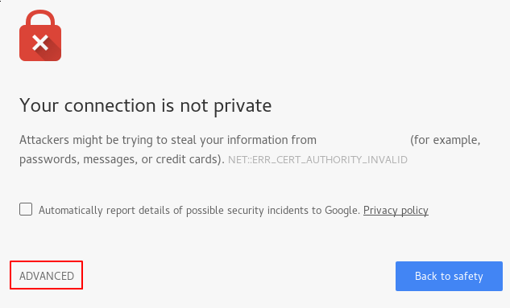

# Решение домашней работы

>1. Установите Bitwarden плагин для браузера. Зарегестрируйтесь и сохраните несколько паролей.

Установил, попробовал - не зашло.
Привык использовать https://passwords.google.com/ на всех устройствах и без танцев с бубном получаю пароли автозаполнением.

>2. Установите Google authenticator на мобильный телефон. Настройте вход в Bitwarden акаунт через Google authenticator OTP.

Сделал упражнение, но пользуюсь OTP (в том числе и на смарт часах) не софтиной от гугла а от jmh "Authenticator Pro"
[LINK](https://play.google.com/store/apps/details?id=me.jmh.authenticatorpro)

!


>3. Установите apache2, сгенерируйте самоподписанный сертификат, настройте тестовый сайт для работы по HTTPS.

```bash
$ sudo openssl req -x509 -nodes -days 365 -newkey rsa:2048 -keyout /etc/ssl/private/apache-selfsigned.key -out /etc/ssl/certs/apache-selfsigned.crt
```
где:
* -openssl: это базовый инструмент командной строки для создания и управления сертификатами OpenSSL, ключами и другими файлами.
* -req: данная субкоманда указывает, что мы хотим использовать управление запросами подписи сертификатов X.509 (CSR). X.509 — это стандарт инфраструктуры открытых ключей, используемый SSL и TLS для управления ключами и сертификатами. Вы хотим создать новый сертификат X.509, и поэтому используем эту субкоманду.
* -x509: это дополнительно изменяет предыдущую субкоманду, сообщая утилите, что мы хотим создать самоподписанный сертификат, а не сгенерировать запрос на подпись сертификата, как обычно происходит.
* -nodes: этот параметр указывает OpenSSL пропустить опцию защиты сертификата с помощью пароля. Для чтения этого файла при запуске сервера без вмешательства пользователя нам потребуется Apache. Кодовая фраза может предотвратить это, поскольку нам придется вводить ее после каждого перезапуска.
* -days 365: данный параметр устанавливает срок, в течение которого сертификат будет считаться действительным. Здесь мы устанавливаем срок действия в один год.
* -newkey rsa:2048: указывает, что мы хотим генерировать новый сертификат и новый ключ одновременно. Мы не создали требуемый ключ для подписи сертификата на предыдущем шаге, и поэтому нам нужно создать его вместе с сертификатом. Часть rsa:2048 указывает, что мы создаем ключ RSA длиной 2048 бит.
* -keyout: эта строка указывает OpenSSL, где мы разместим создаваемый закрытый ключ.
* -out: данный параметр указывает OpenSSL, куда поместить создаваемый сертификат.

Последовательно вводим: код страны, её название, город, название компании, название отдела, FQDN сервера или имя и адрес электронной почты.
```
Country Name (2 letter code) [AU]:RU
State or Province Name (full name) [Some-State]:NSK
Locality Name (eg, city) []:Novosibirsk
Organization Name (eg, company) [Internet Widgits Pty Ltd]: DevOPS
Organizational Unit Name (eg, section) []: DevOPS
Common Name (e.g. server FQDN or YOUR name) []: DevOPStest.com
Email Address []:admin@DevOPStest.com
```

* В каталоге `/etc/ssl` сгенерировались 2 файла:
  * certificate.crt — сам сертификат; 
  * privateKey.key — файл ключа.

###Настройка Apache 

Создание сниппета конфигурации Apache с надежными настройками шифрования

Новый сниппет в каталоге /etc/apache2/conf-available. Мы назовем файл ssl-params.conf, чтобы сделать его назначение очевидным:
`sudo nano /etc/apache2/conf-available/ssl-params.conf`

Вставляем туда готовый конфиг из cipherli.st:

```
SSLCipherSuite EECDH+AESGCM:EDH+AESGCM:AES256+EECDH:AES256+EDH
SSLProtocol All -SSLv2 -SSLv3 -TLSv1 -TLSv1.1
SSLHonorCipherOrder On
# Disable preloading HSTS for now.  You can use the commented out header line that includes
# the "preload" directive if you understand the implications.
# Header always set Strict-Transport-Security "max-age=63072000; includeSubDomains; preload"
Header always set X-Frame-Options DENY
Header always set X-Content-Type-Options nosniff
# Requires Apache >= 2.4
SSLCompression off
SSLUseStapling on
SSLStaplingCache "shmcb:logs/stapling-cache(150000)"
# Requires Apache >= 2.4.11
SSLSessionTickets Off
```
Изменение файла виртуального хоста Apache SSL по умолчанию

Изменим `/etc/apache2/sites-available/sl.conf`, используемый по умолчанию файл виртуального хоста Apache SSL

```
$ sudo cp /etc/apache2/sites-available/default-ssl.conf /etc/apache2/sites-available/default-ssl.conf.bak
$ sudo nano /etc/apache2/sites-available/default-ssl.con
```
Правим конфиг:
```
<IfModule mod_ssl.c>
        <VirtualHost _default_:443>
                ServerAdmin admin@DevOPStest.com
                ServerName DevOPStest.com

                DocumentRoot /var/www/html

                ErrorLog ${APACHE_LOG_DIR}/error.log
                CustomLog ${APACHE_LOG_DIR}/access.log combined

                SSLEngine on

                SSLCertificateFile      /etc/ssl/certs/certificate.crt
                SSLCertificateKeyFile /etc/ssl/private/privateKey.key

                <FilesMatch "\.(cgi|shtml|phtml|php)$">
                                SSLOptions +StdEnvVars
                </FilesMatch>
                <Directory /usr/lib/cgi-bin>
                                SSLOptions +StdEnvVars
                </Directory>

        </VirtualHost>
</IfModule>
```
_Далее пропущу перенаправление по умолчанию с http на http и настройку фаервола..._

###Активация изменений в Apache

Мы можем активровать mod_ssl, модуль Apache SSL, и модуль mod_headers, необходимый для некоторых настроек нашего сниппета SSL, с помощью команды a2enmod:
```bash
$ sudo a2enmod ssl
$ sudo a2enmod headers
```
Теперь мы можем активировать виртуальный хост SSL с помощью команды a2ensite:
```bash
$ sudo a2ensite default-ssl
```
Также нам нужно будет активировать файл ssl-params.conf для считывания заданных значений:
```bash
$ sudo a2enconf ssl-params
```
Мы активировали наш сайт и все необходимые модули. Теперь нам нужно проверить наши файлы на наличие ошибок в синтаксисе. Для этого можно ввести следующую команду:
```bash
$ sudo apache2ctl configtest

Output
AH00558: apache2: Could not reliably determine the server's fully qualified domain name, using 127.0.1.1. Set the 'ServerName' directive globally to suppress this message
Syntax OK
```
Если в результатах есть сообщение Syntax OK, значит нет синтаксических ошибок. Мы можем безопасно перезапустить Apache для внесения изменений:

```bash
$ sudo systemctl restart apache2
```
###Тестирование шифрования

Для проверки в хостах на локальной машине поправил 192.168.0.3 DevOPStest.com

Захожу на https://DevOPStest.com

Поскольку созданный сертификат не подписан одним из доверенных центров сертификации вашего браузера, увидим пугающее предупреждение, которое будет выглядеть примерно так:


Такое предупреждение нормально, и его следует ожидать. Сертификат нам нужен только для шифрования, а не для подтверждения подлинности нашего хоста третьей стороной. Нажмите «Дополнительно», а затем нажмите на указанную ссылку, чтобы перейти к своему хосту.

###Заключение

Настроили сервер Apache для использования защищенного шифрования клиентских соединений. Это обеспечит безопасное обслуживание запросов и не даст третьим сторонам возможности считывать трафик.

>4. Проверьте на TLS уязвимости произвольный сайт в интернете (кроме сайтов МВД, ФСБ, МинОбр, НацБанк, РосКосмос, РосАтом, РосНАНО и любых госкомпаний, объектов КИИ, ВПК ... и тому подобное).

Для проверки используем https://www.ssllabs.com/ssltest/analyze.html?d=rt.ru

Используются старые версии TLS 1.0 and TLS 1.1 и нет поддержки TLS 1.3 - не порядок.


>5. Установите на Ubuntu ssh сервер, сгенерируйте новый приватный ключ. Скопируйте свой публичный ключ на другой сервер. Подключитесь к серверу по SSH-ключу.


 ```bash
$ sudo apt install openssh-server
$ sudo systemctl enable sshd
$ ssh-keygen
Output
Generating public/private rsa key pair.
Enter file in which to save the key (/lsrv/.ssh/id_rsa):
Output
/home/your_home/.ssh/id_rsa already exists.
Overwrite (y/n)? y
Output
Your identification has been saved in /your_home/.ssh/id_rsa
Your public key has been saved in /your_home/.ssh/id_rsa.pub
The key fingerprint is:
SHA256:/hk7MJ5n5aiqdfTVUZr+2Qt+qCiS7BIm5Iv0dxrc3ks user@host
The key's randomart image is:
+---[RSA 3072]----+
|                .|
|               + |
|              +  |
| .           o . |
|o       S   . o  |
| + o. .oo. ..  .o|
|o = oooooEo+ ...o|
|.. o *o+=.*+o....|
|    =+=ooB=o.... |
+----[SHA256]-----+
```
###Копирование открытого ключа на сервер Ubuntu

Самый быстрый способ скопировать открытый ключ на хост Ubuntu — использовать утилиту `ssh-copy-id`

```bash
ssh-copy-id lsrv@192.158.0.4
Output
The authenticity of host '192.158.0.4 (192.158.0.4)' can't be established.
ECDSA key fingerprint is fd:fd:d4:f9:77:fe:73:84:e1:55:00:ad:d6:6d:22:fe.
Are you sure you want to continue connecting (yes/no)? yes
Output
/usr/bin/ssh-copy-id: INFO: attempting to log in with the new key(s), to filter out any that are already installed
/usr/bin/ssh-copy-id: INFO: 1 key(s) remain to be installed -- if you are prompted now it is to install the new keys
username@203.0.113.1's password:
Output
Number of key(s) added: 1

Now try logging into the machine, with:   "ssh 'lsrv@192.158.0.4'"
and check to make sure that only the key(s) you wanted were added.
```
Пробуем подключится

```
ssh lsrv@192.158.0.4
............
Using username "lsrv".
Authenticating with public key "lsrv"
Linux lsrv 5.10.0-9-amd64 #1 SMP Debian 5.10.70-1 (2021-09-30) x86_64

The programs included with the Debian GNU/Linux system are free software;
the exact distribution terms for each program are described in the
individual files in /usr/share/doc/*/copyright.

Debian GNU/Linux comes with ABSOLUTELY NO WARRANTY, to the extent
permitted by applicable law.
You have no mail.
lsrv@lsrv:~
$
```

>6. Переименуйте файлы ключей из задания 5. Настройте файл конфигурации SSH клиента, так чтобы вход на удаленный сервер осуществлялся по имени сервера.
```
PS C:\Users\reyso\Desktop> ssh lsrv
The authenticity of host 'lsrv (192.168.0.3)' can't be established.
ECDSA key fingerprint is SHA256:Q40NTz6/itVYhzEJ3UNpOtX+AGYHn9nI2aa9K3MWmb0.
Are you sure you want to continue connecting (yes/no/[fingerprint])? y
Please type 'yes', 'no' or the fingerprint: yes
Warning: Permanently added 'lsrv,192.168.0.3' (ECDSA) to the list of known hosts.
reyso@lsrv's password:
lsrv@lsrv:~
```

>7. Соберите дамп трафика утилитой tcpdump в формате pcap, 100 пакетов. Откройте файл pcap в Wireshark.
```
$ sudo apt install tcpdump
$ sudo tcpdump -w 0001.pcap -с 100
```
Открыл в WS посмотрел....

 ---
